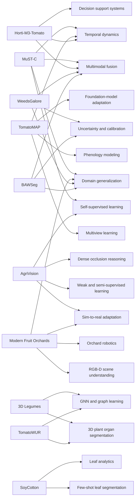
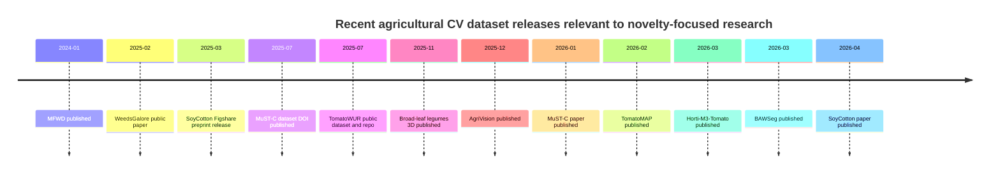

# Underutilized Computer Vision Datasets in Agriculture for Research Novelty

## Executive summary

The most promising underexploited datasets for academic novelty in agricultural computer vision are not necessarily the largest ones. The strongest opportunities now sit at the intersection of **multimodality**, **temporal structure**, **synthetic-to-real transfer**, and **dense supervision**: MuST-C for field-scale multimodal phenotyping, TomatoMAP for fine-grained phenology and multiview learning, AgriVision for supervised–weakly supervised–synthetic dense crop analysis, MFO for orchard-structure understanding with synthetic-to-real RGB-D adaptation, and Horti-M3-Tomato for long-horizon greenhouse crop–environment modeling. Each is recent enough that visible uptake remains modest relative to its research potential. citeturn23view4turn23view2turn25view0turn38view0turn23view0

A consistent pattern across the 2025–2026 landscape is that the highest-value datasets are harder to use than mainstream RGB detection sets. They often require georegistration, multimodal alignment, orthomosaic patching, temporal synchronization, point-cloud toolchains, or nonstandard evaluation protocols. That friction is precisely why they remain underutilized—and why they offer unusually good headroom for methodological contributions in multimodal fusion, temporal transformers, self-supervised pretraining, domain adaptation, uncertainty estimation, and physics-aware trait prediction. This is especially clear in MuST-C, MFO, BAWSeg, WeedsGalore, and the 3D legume/tomato point-cloud datasets. citeturn11view0turn9view0turn29view0turn26view1turn22view0turn32search1

Two important comparators sit just outside the main shortlist but remain useful as controls or auxiliary benchmarks. **PlantSeg** is already gaining traction because it provides 7,774 in-the-wild disease images with segmentation masks across 34 hosts and 69 disease types; it is less “underutilized” than the top niche datasets, but is still valuable for open-vocabulary disease segmentation and transfer learning. **MFWD** is a 2024 dataset with unusually strong temporal depth—94,321 images over 5,000+ tracked plants and 28 weed species—but it is more mature and less novel as a primary paper target than the newest 2025–2026 multimodal resources. citeturn23view3turn36view3turn35view0

The strongest first-paper strategy is to avoid “just train another detector.” Instead, use one of the top-five datasets to define a new benchmark around **cross-year generalization**, **cross-modal robustness**, **time-aware representation learning**, **few-shot transfer**, or **synthetic-to-real adaptation**. Those directions are substantially less crowded than generic segmentation baselines and better aligned with the structure of the new datasets themselves. This is an inference from the datasets’ official design goals, current visible citation/access signals, and the relatively limited method ecosystems currently attached to them. citeturn23view4turn23view2turn25view0turn38view0turn23view0turn29view0turn26view0

## Ranked dataset landscape

The ranking below prioritizes four criteria: dataset quality, methodological headroom, openness/reproducibility, and **relative underuse** as of June 2026.

| Rank | Dataset | Year | Official source | Size | Modalities | Annotation types | Geographic and crop diversity | Licensing | Benchmark tasks | Current visible uptake |
|---|---|---:|---|---|---|---|---|---|---|---|
| 1 | **MuST-C** | 2025 dataset / 2026 paper | Bonn data repository + Sci Data + code repo citeturn11view0turn23view4turn11view1 | **683 public files** over one 2023 growing season; exact total image count is not centrally summarized on the landing page citeturn11view0turn12view3 | RGB, multispectral, LiDAR, orthophotos, DEM-like derivatives, UGV multiview imagery citeturn11view0turn12view0 | Georeferenced multimodal alignment; LAI and biomass reference measurements; plot-wise organization citeturn11view0turn12view2turn12view3 | Six crop species in Germany: sugar beet, wheat, sweet corn, soybean, potato, and wheat–faba-bean intercrop citeturn12view3turn12view2 | **CC BY 4.0** citeturn11view0 | Phenotyping, LAI/biomass estimation, multimodal fusion, temporal alignment, cross-crop generalization citeturn11view0turn23view4 | **5,091 accesses; 3 citations** on Nature page citeturn23view4 |
| 2 | **TomatoMAP** | 2026 | Sci Data + official GitHub/e!DAL repo citeturn23view2turn18view0 | **68,080 RGB images** total: 64,464 moderate-resolution multiview images + 3,616 high-resolution segmentation images from 101 plants over 163 days citeturn23view2 | RGB; multiview; multi-pose; time series citeturn18view0turn23view2 | 50 BBCH stage labels, 7 ROI detection labels, semantic and instance segmentation classes citeturn18view0turn23view2 | Single crop, greenhouse tomato; strong temporal and pose diversity rather than crop diversity citeturn23view2 | Dataset **CC BY 4.0**; code **Apache-2.0** citeturn18view0 | Fine-grained phenology classification, detection, segmentation, multiview learning, 3D reconstruction potential citeturn18view0turn23view2 | **7,692 accesses; 1 citation** on Nature page; repo shows **78 commits** citeturn23view2turn18view0 |
| 3 | **AgriVision** | 2025 | Sci Data + Figshare citeturn25view0turn24search4turn39view0 | **DB-1:** 1,195 fully annotated high-res images; **DB-2:** 141K frames from 520 videos; **DB-3:** 10K synthetic annotated images; full dataset about **88.1 GB** on Figshare citeturn25view0turn24search4 | RGB images, video frames, synthetic imagery citeturn25view0 | Dense crop segmentation annotations; weak/semi-supervised subset; synthetic labels citeturn25view0turn39view0 | Dense blueberry crop, production environment in the UAE; crop diversity is limited but domain realism is strong citeturn25view0 | Public Figshare; explicit dataset license not surfaced in the landing-page text I could verify citeturn39view0turn24search4 | Supervised segmentation, weak/semi-supervised learning, synthetic-to-real adaptation, dense crop analysis citeturn25view0turn39view0 | **4,655 accesses; 2 citations** on Nature page citeturn25view0 |
| 4 | **MFO** | 2025 | CVPRW paper + official GitHub/Box links citeturn9view0turn38view0 | Real data: **223 videos / 160,230 frames** total across cherry and apple; synthetic data: **5,000 RGB+depth images per tree type** plus tree meshes citeturn9view0turn38view0 | RGB, RGB-D, video, synthetic depth, synthetic meshes citeturn9view0turn38view0 | Semantic segmentation, instance segmentation, synthetic labels, partial real labels, domain-adaptation protocol citeturn9view0 | Cherry UFO and Envy apple V-trellis orchards in Oregon State workflows; low crop diversity but high structural diversity citeturn9view0turn38view0 | Code repo **MIT**; dataset links are public in Box, but dataset-specific license is not clearly stated in the surfaced repo text citeturn38view0 | Orchard structure parsing, robotic pruning, synthetic-to-real UDA, RGB-D segmentation citeturn9view0turn38view0 | **Cited by 1** in CVF/Xplore search results; repo shows **5 stars** citeturn31search4turn38view0 |
| 5 | **Horti-M3-Tomato** | 2026 | Sci Data + Zenodo citeturn13view3turn23view0 | Three seasons (2023–2025) of daily top-view RGB images, captured **four times per day**, plus environmental logs every 30 minutes and weekly phenotypes; exact total image count is not centrally summarized citeturn14view0turn14view2turn14view4 | RGB, environmental IoT time series, soil data, agronomic logs citeturn14view1turn14view4 | Phenotypes, yield records, fertilization/managment metadata, temporal alignment; not a classical segmentation dataset citeturn14view3turn14view4 | Greenhouse tomato in Northeast China, 42 experimental conditions across 3 years × 2 varieties × 7 treatments citeturn14view4 | Open-access Zenodo release; exact dataset license is described only generically in the surfaced article text citeturn13view3turn37search0 | Growth modeling, multimodal forecasting, treatment-effect learning, environment-aware phenotyping, yield prediction citeturn14view1turn14view4 | **1,762 accesses; 4 Altmetric** on Nature page; citation signal still immature due March 2026 publication citeturn23view0 |
| 6 | **Annotated 3D Point Cloud Dataset of Broad-Leaf Legumes** | 2025 | Sci Data + Figshare + GitHub citeturn22view0turn21search2turn21search8 | **223 multispectral 3D scans**, about **597 MB** on Figshare citeturn22view1turn21search2 | Multispectral 3D point clouds from PlantEye F600 citeturn22view0 | Organ-level labels: embryonic leaf, leaf, petiole, stem, plant; plus KITTI-style cuboids and baseline code citeturn22view0 | Four broad-leaf legumes: mungbean, common bean, cowpea, lima bean; captured at ICRISAT in India citeturn22view1turn22view0 | Public Figshare/GitHub; explicit dataset license not surfaced in the text snippets I could verify citeturn22view0turn21search2 | 3D organ segmentation, point-cloud detection, phenomics, plant-structure modeling citeturn22view0 | **3,213 accesses; 5 citations** on Nature page citeturn22view1 |
| 7 | **BAWSeg** | 2026 | Remote Sensing paper + arXiv/UWA record citeturn29view0turn28search4turn30search1 | Four-year UAV benchmark over commercial barley paddocks; exact patch / image count not surfaced in the snippets I could verify citeturn29view0turn28search4 | Five-band multispectral orthomosaics + vegetation indices citeturn29view0turn28search4 | Dense pixel labels for crop, weed, and other; leakage-free within-plot, cross-plot, and cross-year splits citeturn29view0 | Western Australia barley paddocks; low crop diversity but very strong temporal and field-shift diversity citeturn29view0turn28search4 | Public release was still described as “will be released upon publication” in the article/repository records I found; license therefore remains unclear in practice citeturn29view0turn30search1 | Multispectral segmentation, domain shift, cross-year robustness, uncertainty-aware weed mapping citeturn29view0turn28search4 | **Cited by 1** in MDPI/arXiv search results; very early usage signal citeturn28search6turn28search4 |
| 8 | **SoyCotton** | 2026 | Sci Data + Figshare + code repo citeturn20view0turn19search2turn19search1 | **640 RGB images**, **12,000+ leaf instances** (7,221 soybean, 5,190 cotton) citeturn20view3turn19search2 | RGB | Bounding boxes + instance masks in COCO format citeturn20view0turn20view2 | São Paulo, Brazil; soybean and cotton leaves under dense overlap and weeds/background complexity citeturn20view3turn19search2 | **CC BY 4.0** citeturn20view0turn20view2 | Leaf-level detection/segmentation, volunteer-plant detection, canopy analytics citeturn20view0turn19search2 | **2,067 accesses; 1 citation** on Nature page citeturn23view1 |
| 9 | **TomatoWUR** | 2025 | PubMed/Data in Brief entry + official GitHub + WUR dataset page citeturn8search4turn32search1turn32search6 | **44 point clouds** of single tomato plants from **15 cameras** using shape-from-silhouette reconstruction citeturn8search4 | 3D colored point clouds | Segmentation labels, skeletons, manual plant-trait measurements citeturn8search4turn32search1 | Single species, controlled setting; strong trait-validation value rather than crop diversity citeturn8search4 | Dataset DOI is public; repo tools are **GPL-3.0**; dataset license was not explicit in the surfaced snippets I could verify citeturn32search1turn32search6 | 3D segmentation, skeletonization, trait extraction, 2D-to-3D reprojection benchmarking citeturn32search1 | **Cited by 2** in PubMed snippet; repo shows **22 stars** citeturn8search4turn32search5 |
| 10 | **WeedsGalore** | 2025 | Official GitHub + WACV open-access paper + GFZ dataset DOI citeturn26view0turn26view1 | **156 annotated 600×600 images**, sampled across four campaigns, plus **4 orthomosaics**; roughly **1,150 captured images per campaign** before selection citeturn27view3 | 5-band multispectral UAV imagery: RGB, red-edge, NIR citeturn26view1 | Dense semantic and instance masks for maize + four weed classes citeturn26view1turn27view1 | Potsdam, Germany; maize field, multitemporal growth stages, realistic weed density citeturn26view1turn27view1 | Dataset **CC BY**; repo code **Apache-2.0** citeturn26view0 | Semantic/instance segmentation, calibration, uncertainty quantification, OOD deployment on orthomosaics citeturn26view1 | **Cited by 30** in WACV/IEEE search results; repo shows **35 stars** citeturn7search17turn26view0 |

Two comparator datasets are still worth keeping in reserve. **PlantSeg** is unusually strong for disease segmentation—7,774 in-the-wild images, 115 disease categories, and a CC BY-NC 4.0 release—but visible uptake is already climbing, so it is better used as a transfer-learning or benchmarking control than as the centrepiece of a novelty-driven dataset paper. **MFWD** remains excellent for temporal weed tracking and multi-task learning with 94,321 images, 28 weed species, and support for classification, detection, instance segmentation, and MOT, but it is now more “established recent data” than “underused frontier.” citeturn23view3turn36view3turn36view4turn35view0

The following diagram summarizes the strongest dataset–task connections visible in the official papers and repositories. citeturn23view4turn23view2turn25view0turn38view0turn23view0turn29view0turn26view1

The release cadence also matters for novelty: several of the best opportunities are so new that benchmark ecosystems have barely formed. citeturn23view4turn23view2turn25view0turn23view0turn29view0turn35view0

## Why these datasets are underused and what they enable

The underutilization story is not the same across all datasets. Some are underused because they are brand new; others because they are technically difficult; and others because they sit in narrow agricultural niches that mainstream CV researchers rarely touch.

| Dataset | Why it is still underused | What it enables beyond routine baselines | Best first methodological angle |
|---|---|---|---|
| **MuST-C** | Multisensor alignment, season-long organization, geospatial preprocessing, and plot-wise phenotyping make it much harder than “train on JPEGs.” The official landing page emphasizes georeferenced multimodal plot data rather than ready-made leaderboard tasks. citeturn11view0turn12view3 | Cross-modal masked autoencoding, LiDAR–RGB–multispectral fusion, phenotypic trait regression with uncertainty, cross-crop transfer, physically grounded trait prediction. citeturn11view0turn23view4 | A **cross-crop multimodal foundation encoder** with separate spectral/spatial/3D tokenizers and shared temporal alignment loss. |
| **TomatoMAP** | Fine-grained BBCH labels are rich but hard; multi-pose and multi-angle design requires temporal and geometric reasoning, not just image classification. Uptake is still minimal despite high access counts. citeturn23view2turn18view0 | Time-aware phenology models, multiview representation learning, pose-consistent self-supervision, graph reconstruction of developmental stage transitions. citeturn23view2 | A **temporal multiview transformer** that treats pose and time as separate positional factors and predicts BBCH stage trajectories, not single images. |
| **AgriVision** | Blueberry robotics is application-specific, and the dataset is heavy. Many groups will use only DB-1 and ignore DB-2/DB-3, leaving the richest weak-label and synthetic opportunities underexploited. citeturn25view0turn39view0 | Weak/semi-supervised dense segmentation, synthetic-to-real adaptation, occlusion-aware segmentation, active learning for annotation reduction. citeturn25view0 | A **tri-partite curriculum**: DB-3 synthetic pretraining → DB-2 pseudo-label refinement → DB-1 supervised calibration. |
| **MFO** | Orchard-branch segmentation is niche, RGB-D outdoors is messy, and the benchmark is split between synthetic and partially labeled real data. That combination is excellent for research but unattractive for routine benchmarking. citeturn9view0turn38view0 | Synthetic-to-real UDA, depth-guided pruning perception, structure-aware segmentation, topology-preserving losses for thin branches. citeturn9view0 | A **topology-aware UDA model** with depth priors and branch-skeleton consistency losses. |
| **Horti-M3-Tomato** | It is not a classic detection/segmentation benchmark. The signal is longitudinal, multimodal, and treatment-aware, so it fits forecasting and control more than standard CV leaderboards. citeturn14view1turn14view4 | Crop digital twins, environment-conditioned visual forecasting, treatment-effect estimation, causal representation learning in greenhouse settings. citeturn14view4turn23view0 | A **vision–time-series fusion model** for growth and yield forecasting under treatment shifts. |
| **3D Legumes** | Point-cloud phenotyping is still a small subfield; 3D toolchains remain harder to reproduce than image pipelines. citeturn22view0turn22view1 | Organ-level 3D segmentation, point-cloud detection, structured latent representations of legumes, graph extraction from multispectral 3D scans. citeturn22view0 | A **point-cloud transformer with organ hierarchy constraints**. |
| **BAWSeg** | The dataset is extremely recent, and public release friction still seems to be a practical barrier. Orthomosaic-based multispectral segmentation also demands specialized preprocessing and evaluation choices. citeturn29view0turn30search1 | Cross-year robustness, leakage-free geographic evaluation, explicit radiance/index disentanglement, calibration under domain shift. citeturn29view0 | A **two-stream radiance–VI foundation segmenter** with test-time adaptation. |
| **SoyCotton** | The dataset is small in image count, so many researchers may dismiss it. That is a mistake: the annotation granularity is unusually good, and the leaf-overlap problem is genuinely hard. citeturn20view3turn19search2 | Few-shot instance segmentation, dense leaf separation, volunteer-plant analytics, label-efficient segmentation. citeturn20view0turn20view2 | A **few-shot instance segmenter** with contour-aware prompts or SAM-style adapters. |
| **TomatoWUR** | Small-N 3D phenotyping is often considered “too small,” but the presence of skeletons and manual measurements makes it ideal for trait-supervised benchmarks. citeturn8search4turn32search1 | Skeleton extraction, graph neural networks, trait-supervised representation learning, 2D-to-3D lifting. citeturn32search1turn32search2 | A **graph-constrained 3D reconstructor** that jointly predicts organ labels and phenotypic traits. |
| **WeedsGalore** | It is better known than the others, but the real underuse is methodological: most users still treat it as a plain segmentation dataset instead of a multispectral, multitemporal, uncertainty-sensitive benchmark. citeturn26view1turn26view0 | Calibration, uncertainty estimation, OOD deployment to orthomosaics, spectral attention, temporal crop–weed disambiguation. citeturn26view1 | A **calibrated multispectral segmenter** with abstention and active-label acquisition. |

The highest-novelty pattern is clear: the most valuable datasets are those whose official papers already hint at harder tasks than the community is currently benchmarking. MFO is explicit about synthetic-to-real UDA and limited real annotations; AgriVision is explicit about supervised/weak/synthetic subsets; TomatoMAP is explicit about multiview time-series phenology; MuST-C is explicit about aligned multimodal crop phenotyping; and BAWSeg is explicit about cross-plot and cross-year evaluation. Using the datasets “as designed,” rather than flattening them into ordinary supervised training sets, is the likeliest route to publishable novelty. citeturn9view0turn25view0turn23view2turn11view0turn29view0

## Gaps and benchmark designs that would raise novelty

The current dataset landscape still has four structural gaps.

First, **multimodal temporal benchmarks with dense labels remain rare**. MuST-C and Horti-M3-Tomato contain precisely the kind of aligned sensing and longitudinal metadata needed for robust temporal learning, but neither has yet become a standard benchmark for time-aware multimodal representation learning. A high-value contribution would be to define a common protocol for future-frame trait forecasting, missing-modality robustness, and cross-crop transfer on MuST-C, then compare it with greenhouse forecasting on Horti-M3-Tomato. citeturn11view0turn12view3turn14view1turn14view4

Second, **synthetic-to-real adaptation is present in the data, but weak in current benchmarking practice**. MFO and AgriVision both expose unusually clean opportunities for synthetic pretraining followed by real-world adaptation, while BAWSeg and WeedsGalore expose domain shift across plots, fields, years, and conditions. A compelling benchmark paper would evaluate the same family of methods—source-only training, feature alignment, masked-image adaptation, prompt tuning, diffusion-based style transfer, and test-time adaptation—across at least two of these datasets rather than on only one. citeturn9view0turn25view0turn29view0turn26view1

Third, **3D plant structure datasets still lack a shared graph-centric phenotyping benchmark**. The 3D legume dataset, TomatoWUR, and the newer TomatoPGT ecosystem all point toward the same missing benchmark class: semantic segmentation → skeleton extraction → trait prediction in one pipeline. Today, most papers isolate only one stage. A much stronger paper would evaluate joint learning and error propagation across stages, ideally with trait-level endpoints and organ-level explainability. This is strongly supported by the structure of TomatoWUR and the legume dataset, and is also consistent with the way TomatoPGT is framed in its abstract and tools repository. citeturn22view0turn8search4turn32search1turn33search1turn33search0

Fourth, **foundation-model adaptation in agriculture is still shallow**. TomatoMAP explicitly benchmarks CNNs, detection models, and segmentation pipelines, but its multiview-temporal structure makes it a better target for contrastive or masked pretraining. MuST-C can support cross-modal agricultural pretraining. PlantSeg can support open-vocabulary lesion segmentation because it stores URLs and license metadata per image. A high-novelty benchmark could test frozen-backbone prompting, low-rank adaptation, and multimodal adapters across these datasets while measuring not just accuracy but calibration and out-of-domain transfer. citeturn23view2turn11view0turn36view2turn36view4

A good set of experiments that would likely increase novelty is shown below.

| Benchmark idea | Primary dataset(s) | Why it is novel now | Suggested metric set |
|---|---|---|---|
| Cross-crop multimodal masked pretraining | MuST-C | Few agricultural papers yet exploit aligned RGB–LiDAR–multispectral field data across multiple crops in one self-supervised setup. citeturn11view0turn12view2 | Trait RMSE, cross-crop transfer delta, missing-modality robustness |
| Time-aware BBCH forecasting | TomatoMAP | Most current use will likely stop at frame-wise classification; stage-transition forecasting is substantively harder. citeturn23view2 | Stage accuracy, temporal consistency, edit distance on predicted development sequence |
| Synthetic → weakly labeled → supervised curriculum | AgriVision | The dataset structure itself is unusually well suited for this, but it invites more than one learning regime. citeturn25view0 | mIoU, DICE, label-efficiency curves, calibration error |
| Structure-aware orchard UDA | MFO | Thin-branch topology and RGB-D synthetic-to-real transfer are still uncommon in agricultural CV. citeturn9view0turn38view0 | branch IoU, topology preservation, zero-shot real transfer |
| Cross-year generalized weed mapping | BAWSeg + WeedsGalore | Great for studying whether spectral priors or foundation-style adaptation survive domain shift. citeturn29view0turn26view1 | weed IoU, cross-year mIoU, ECE, abstention risk coverage |
| Joint segmentation–skeleton–trait benchmark | 3D Legumes + TomatoWUR | This connects two currently separate sub-literatures. citeturn22view0turn32search1 | organ IoU, graph edit distance, trait MAE |

## Feasibility, compute, annotation cost, and legal considerations

Feasibility varies far more by data format than by publication venue. MuST-C, MFO, AgriVision, BAWSeg, and WeedsGalore are the most expensive to handle because they create storage, patching, and preprocessing burdens before model training even starts. MuST-C exposes hundreds of public files and large UAV/UGV captures; AgriVision’s full Figshare release is about 88.1 GB; WeedsGalore separates image tiles from 12 GB of orthomosaics; MFO mixes videos, RGB-D, and synthetic meshes; BAWSeg depends on radiometrically calibrated orthomosaics and deployment-oriented split design. Those are all feasible for a university lab, but they reward engineering discipline more than brute-force model scaling. citeturn11view0turn24search4turn26view0turn38view0turn29view0

A practical rule of thumb is that **single-GPU work is realistic** for SoyCotton, TomatoMAP, Horti-M3-Tomato, TomatoWUR, and the 3D legumes dataset, while **24–48 GB GPU memory or patch-based distributed training** becomes more useful for MuST-C, AgriVision, WeedsGalore orthomosaics, BAWSeg, and video-heavy MFO workflows. The reason is not always parameter count; it is often patch size, modality stacking, or the need to maintain geometric fidelity in thin structures or small weed clutter. This is an inference from the official dataset structures, file volumes, and the kinds of baselines reported by the authors. citeturn11view0turn23view2turn24search4turn26view0turn38view0turn29view0

Annotation cost is one of the clearest novelty levers. Dense instance masks in WeedsGalore, SoyCotton, AgriVision DB-1, and MFO are expensive to replicate manually, which makes **label-efficient learning**, **active learning**, and **SAM-assisted annotation correction** publishable topics in their own right. TomatoMAP explicitly describes progressive AI-assisted labeling for detection, and MFO explicitly describes SAM-based propagation followed by manual correction. That means a paper on annotation-efficient agricultural vision can be grounded in the authors’ own curation pipelines rather than introduced artificially. citeturn20view0turn25view0turn23view2turn9view0

The legal picture is mixed and deserves care. MuST-C is clearly CC BY 4.0; SoyCotton is CC BY 4.0; WeedsGalore is CC BY; PlantSeg is CC BY-NC 4.0; TomatoMAP’s dataset is CC BY 4.0 while its code is Apache-2.0. By contrast, Horti-M3-Tomato, AgriVision, TomatoWUR, the 3D legumes dataset, and MFO do not surface a dataset license cleanly in the snippets I could verify, even though the data are public. For commercial or industry-collaborative projects, this matters materially. PlantSeg also deserves special scrutiny because its images were gathered from web sources under Creative Commons filtering, with URL and license metadata stored per image; that is responsible curation, but it still means downstream users should preserve provenance and check terms carefully. citeturn11view0turn20view0turn26view0turn36view4turn18view0turn36view2

Ethically, the main issues are not human subjects but **farm confidentiality**, **location sensitivity**, **platform bias**, and **deployment risk**. Datasets from a single greenhouse, orchard system, or region can induce overconfident models that fail silently in new agronomic conditions. The datasets that explicitly include cross-year, cross-plot, multitemporal, or differentiated treatment conditions—MuST-C, Horti-M3-Tomato, BAWSeg, WeedsGalore, and TomatoMAP—are therefore better foundations for robust science than static single-scene sets. Researchers should report calibration and uncertainty, not just mIoU, especially for selective spraying, disease management, or pruning robotics. citeturn23view4turn23view0turn29view0turn26view1turn23view2

## Prioritized shortlist and recommended first projects

### Top five datasets to start with

The shortlist below balances expected publishability, infrastructure burden, and room for methodological novelty.

| Priority | Dataset | Why it makes the shortlist | Recommended first project | Expected impact |
|---|---|---|---|---|
| **First** | **MuST-C** | Broadest combination of modalities, crops, aligned geometry, and phenotyping targets; still lightly cited relative to scope. citeturn23view4turn11view0 | **Cross-modal agricultural MAE** for RGB–LiDAR–multispectral trait estimation with missing-modality robustness and cross-crop evaluation. | High. Strong chance of a method + benchmark paper that remains relevant beyond one crop. |
| **Second** | **TomatoMAP** | Fine-grained phenology, multiview pose control, segmentation subset, and very low citation count despite high visibility. citeturn23view2turn18view0 | **Temporal multiview phenology transformer** predicting BBCH stages and future stage transitions. | High. Attractive to both CV and plant-phenotyping audiences. |
| **Third** | **AgriVision** | Excellent structure for semi-supervised and synthetic-to-real learning; dense berry occlusion is genuinely hard. citeturn25view0 | **Three-stage curriculum** across DB-3 → DB-2 → DB-1 with uncertainty filtering and active relabeling. | High. Practical agricultural robotics relevance and clear ablation story. |
| **Fourth** | **MFO** | Rare public benchmark for orchard structure understanding with synthetic and RGB-D data. citeturn9view0turn38view0 | **Topology-preserving UDA** for branch segmentation with geometric consistency losses. | High but more niche. Excellent if your lab likes robotics, 3D, or orchard automation. |
| **Fifth** | **Horti-M3-Tomato** | Long-horizon multimodal greenhouse data remains unusual and underbenchmarked. citeturn23view0turn14view4 | **Vision–environment fusion model** for growth and yield forecasting under treatment shifts. | Medium-high. Particularly strong for precision horticulture, digital twins, and controlled-environment agriculture. |

### Project recommendations in plain terms

If you want the **best balance of novelty and tractability**, start with **TomatoMAP** or **Horti-M3-Tomato**. Both are easier to operationalize than MuST-C or MFO, but still rich enough to support nontrivial modeling. TomatoMAP is the cleaner path if you want a CV-centric paper with phenology and multiview structure; Horti-M3-Tomato is the cleaner path if you want a multimodal time-series paper with decision-support relevance. citeturn23view2turn23view0

If your goal is **maximum long-term impact**, MuST-C is the strongest single dataset in this list because it is broad enough to support several papers: self-supervised multimodal pretraining, crop-agnostic trait prediction, modality ablation, and domain generalization. The main downside is engineering complexity rather than scientific weakness. citeturn11view0turn23view4

If you want a paper with a clear **robotics deployment story**, choose AgriVision or MFO. AgriVision is stronger for dense segmentation and learning-regime comparisons; MFO is stronger for structure-aware perception, synthetic-to-real transfer, and pruning-related reasoning. citeturn25view0turn9view0

If you specifically want to differentiate yourself methodologically, the cleanest underexploited directions are these:

- **Multimodal self-supervised learning:** MuST-C first, Horti-M3-Tomato second. citeturn11view0turn14view1
- **Temporal agricultural vision:** TomatoMAP first, Horti-M3-Tomato second, MFWD as an auxiliary comparator. citeturn23view2turn23view0turn35view0
- **Synthetic-to-real adaptation:** MFO first, AgriVision second, BAWSeg as a harder extension if access improves. citeturn9view0turn25view0turn29view0
- **3D graph-based phenotyping:** TomatoWUR plus the 3D legumes dataset. citeturn32search1turn22view0
- **Few-shot or annotation-efficient segmentation:** SoyCotton and AgriVision. citeturn20view0turn25view0

The bottom line is that **MuST-C, TomatoMAP, AgriVision, MFO, and Horti-M3-Tomato** are the best starting points if your objective is not just to use a recent agricultural dataset, but to publish something that is methodologically new and still relevant two years from now. citeturn23view4turn23view2turn25view0turn38view0turn23view0